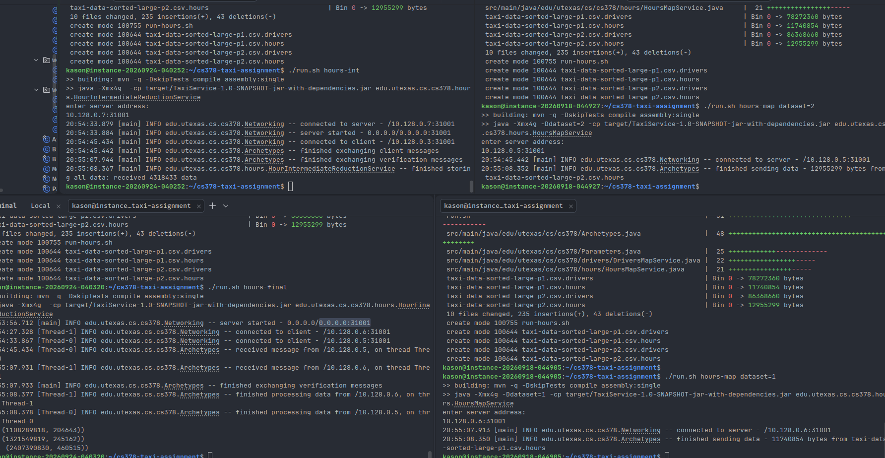
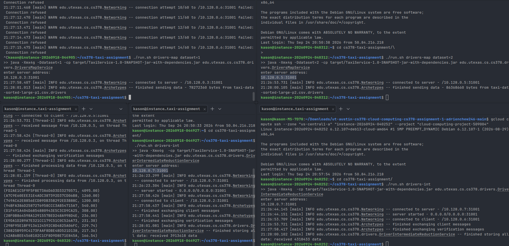

# Please add your team members' names here. 

## Team members' names 

1. Student Name: Adrien Chew

   Student UT EID: auc99

2. Student Name: Kason Gu

   Student UT EID: kkg762

 ...

##  Course Name: CS378 - Cloud Computing 

##  Unique Number: 51515
    


# Add your Project REPORT HERE 

This project was created based on our results from Assignment 2, so we did not use
the template provided.

Task 1:

We built using the architecture provided (2x clients,
2x intermediate reducers, 1 final). 

For our clients, we reused the code from last assignment;
reading the csv, changing the filter conditions to match, and sending
the data to the next stage servers.

Since the NIO Files API is parallel, we read more than
we can send since networking is single threaded. Java's Streaming API
will buffer the results, but this builds up and makes us run out of memory. 
To avoid this, we built a rotating buffer, such that we fill the rotating
pages of data. This ensures that our networking threads are always working,
while the other threads can move our data over. 

Last week, our assignment code took a very long time to execute, and we suspected
this was because our code forced 1 thread to work on networking and the others
to read from storage. This worked, but it meant that we would only be able to work
at the speed of the lowest thread. In order to alleviate this, instead of assigning
threads roles, we made each thread do both; it would fill the buffer, and if
there was any buffer full, it would start writing it to network. This took a lot
of multithreading debugging unfortunately, which was a very painful experience.
The code is in BinaryRotatingBufferStream.java.

This sent a stream of TripHourData, which was the relevant data from the csv.

For our intermediate reducers, we reused last week's reducers to reduce the data.
Then, rather than outputting the results to the console, it was sent to a final server.

This returned a singular HoursEarningsAggregateData, which stored the combined results
of the data it was given.

The final reducer was also based on last week's reducer. It simply took aggregate data
from the intermediate reducers and created a singular HoursEarningsAggregateData. Then
it created HourFinalData from that aggregate data, and then sorted it and printed it out
according to the specification.

Readiness communication

As specified, we had a system for running only when all the servers were ready.

For each client - server interaction, the client would first send an int CLIENT_READY,
after which the server would respond with SERVER_READY only when it was ready. Only
after this message could the client act.

For the intermediate reducer, after the CLIENT_READY is received from the mappers, 
we send the final server a CLIENT_READY. After this final reducer returns SERVER_READY,
we return SERVER_READY to the client. This ensures that all the devices are ready before
any messages are sent. Much of this code is in Networking.java

Task 2: 

Very similar architecture as task 1, essentially the same thing, 
except that the aggregate data wasn't a fixed binary size. This
required a new serializer for our aggregate data, but the rest
of the code was nearly the same, just with different
properties.

This was also why we moved our core logic to an Archetypes file, since
we could very easily reuse our code.

Task 3:
./download.sh 1
./download.sh 2

Task 4:

As an optimization (to reduce the amount of time needed, and since the
VAST majority of the time spent was waiting for the disks to work), we
precompiled our csv data on local machines, and used that on the google cloud.   
This meant that we stored the filtered data (in a serial format), and used
that directly, instead of reading the 16+GB directly.

Task 1:


1 of the intermediate reduction consoles is not shown, since I usually
use tabs and having all 5 consoles made it hard to read in my opinion.

We can see the log messages that indicate that the servers only run
when all servers are open, after the verification messages are ready. The
runtime is very fast, because it's only reading the filtered, optimized CSV, which is
~600x smaller than the original.

Results:

(5, (1108289818, 204643))
(6, (1321549819, 245162))
(15, (2407390830, 460515))

Task 2:


I found new tech to have all the consoles display, but was too lazy to redo the
first task.

(FD2AE1C5F9F5FBE73A6D6D3D33270571, 4095.00)
(A7C9E60EEE31E4ADC387392D37CD06B8, 1260.00)
(749AC62E8856ECD89DB35B292ED3B88C, 1200.00)
(94BFA386D2587276958CCC3AB54715A7, 540.00)
(D1F491A404D6854880943E5C3CD9CA25, 308.00)
(28F0B864598A1291557BED248A998D4E, 236.00)
(E9DA1D289A7E321CC179C51C0C526A73, 231.30)
(298F95E1BF9136124592C8D4825A06FC, 229.74)
(38825B959C4173FAAF8DBE48D521D138, 217.36)
(42AB6BEE456B102C1CF8D9D8E71E845A, 166.54)

# Project Template

This is a Java Maven Project Template

# How to compile the project

We use Apache Maven to compile and run this project. 

You need to install Apache Maven (https://maven.apache.org/)  on your system. 

Type on the command line: 

```bash
mvn clean compile
```
# How to create a binary runnable package

```bash
mvn clean compile assembly:single
```
